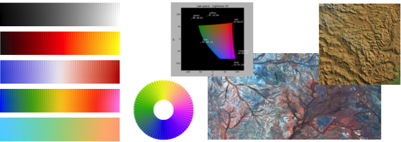
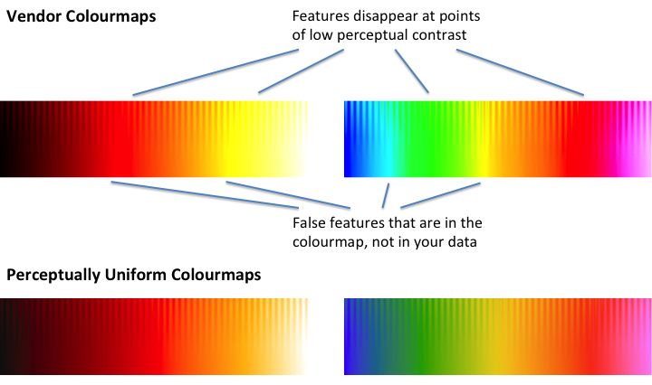
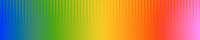
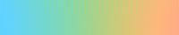

PerceptualColourMaps  
====================

# (Perceptual Color Maps)

[](https://travis-ci.org/peterkovesi/PerceptualColourMaps.jl)

--------------------------------------------  



## Installation

Install via the package manager

```
> Pkg.add("PerceptualColourMaps")
```

## Summary

The Perceptual Colour/Color Maps package provides functions for creating
high quality colour maps that have consistent perceptual contrast over
their full range.  It also provides functions for generating colour
map test images, functions to assist with the correct rendering of
data with colour maps, and functions for generating relief shaded
images and perceptually uniform ternary images.

Many colour maps provided by vendors have highly uneven perceptual
contrast over their range. Colour maps may have points of locally high
colour contrast leading to the perception of false anomalies in your
data when there is none. Conversely colour maps may also have 'flat
spots' of low perceptual contrast that prevent you from seeing
features in the data.

To illustrate this the colour maps shown below are rendered on a test
image consisting of a sine wave superimposed on a ramp function. The
amplitude of the sine wave is modulated from its full value at the top
of the image to 0 at the bottom.

What we are hoping to see is the sine wave uniformly visible across
the image from left to right. We also want the contrast level, the
distance down the image at which the sine wave remains discernible,
to be uniform across the image. At the very bottom of the image, where
the sine wave amplitude is 0, we just have a linear ramp which simply
reproduces the colour map. Given that the underlying data is a
featureless ramp, we should not perceive any identifiable features
across the bottom of the image.



At the top row of the test image, the sine wave amplitude from peak to
trough is 10% of the total data range. It is not unusual for the sine
wave pattern to completely disappear in parts of some vendor colour
maps. On the other hand the perceptually uniform colour maps exhibit
no false features and the sine wave pattern is uniformly visible
across the full width of the test image.

Previous work that has tried to use CIELAB space for the design of colour maps
has had mixed results.  This is because CIELAB space is only perceptually
uniform for large patches of colour presented at very low spatial frequencies.
The key observation is that at fine spatial frequencies perceptual contrast is
dominated by *lightness* difference; chroma and hue are relatively unimportant.
The colour maps generated by `cmap()` are designed to have a lightness gradient of
constant magnitude.


## cmap()

`cmap()` is the main function you will use.  It provides a library of
perceptually uniform colour maps.  For a full description of all the
functions in the package, see the [Function reference](doc/index.md).

```
Usage:  1:  (map, name, desc) = cmap(I, keyword_params ...)
        2:  cmap(searchStr)
        3:  cmap()

Arguments for Usage 1:

            I - A string label indicating the colour map to be generated or a
                string specifying a colour map name or attribute to search
                for.  Type 'cmap()' with no arguments to get a full list of
                possible colour maps and their corresponding labels.

  labels:  "L1" - "L15"  for linear maps
           "D1" - "D12"  for diverging maps
           "C1" - "C9"   for cyclic maps
           "R1" - "R3"   for rainbow maps
           "I1" - "I3"   for isoluminant maps

 Some colour maps have alternate labels for convenience and readability.

   map = cmap("L1")  or map = cmap("grey")  will produce a linear grey map.
   cmap()  lists all colour maps and labels.

 Possible keyword parameter options:

    chromaK::Real - The scaling to apply to the chroma values of the colour map,
                    0 - 1.  The default is 1 giving a fully saturated colour map
                    as designed. However, depending on your application you may
                    want a colour map with reduced chroma/saturation values.
                    You can use values greater than 1 however gamut clipping is
                    likely to occur giving rise to artifacts in the colour map.
           N::Int - Number of values in the colour map. Defaults to 256.
      shift::Real - Fraction of the colour map length N that the colour map is
                    to be cyclically rotated, may be negative.  (Should only be
                    applied to cyclic colour maps!). Defaults to 0.
    reverse::Bool - If true reverses the colour map. Defaults to false.
diagnostics::Bool - If true displays various diagnostic plots. Note the
                    diagnostic plots will be for the map _before_ any cyclic
                    shifting or reversing is applied. Defaults to false.

Returns:
          map - Array of ColorTypes.RGB{Float64,1} giving the rgb colour map
         name - A string giving a nominal name for the colour map
         desc - A string giving a brief description of the colour map
```
Usage 2 and 3:  `cmap(searchStr)`

Given the large number of colour maps that this function can create this usage
option provides some help by listing the numbers of all the colour maps with
names containing the string 'str'.  Typically this is used to search for
colour maps having a specified attribute: "linear", "diverging", "rainbow",
"cyclic", or "isoluminant" etc.  If 'searchStr' is omitted, all colour maps are
listed.  

```
   cmap()              # lists all colour maps
   cmap("diverging")   # lists all diverging colour maps
```
Note the listing of colour maps can be a bit slow because each colour map has to
be created in order to determine its full name.

**Using the colour maps:**

```
> Using PyPlot
> sr = sineramp();    # Generate the sineramp() colour map test image.
> imshow(sr);         # Display with matplotlib's default 'jet' colour map.
                      # Note the perceptual dead spots in the map.
> set_cmap(ColorMap(cmap("L3")[1])) # Apply the cmap() heat colour map.
```
Note above in the call `cmap("L3")[1]`, the `[1]` ensures that just the colour
map in the tuple returned by `cmap()` is passed to the `PyPlot.ColorMap`
constructor

```
> Using Winston
> colormap(cmap("R1")[1]); # Set Winston's colour map to the cmap() rainbow
                           # colour map first.
> imagesc(sr);             # Then display the image

```

You can also apply a colour map to a single channel image to create a
conventional RGB image. This is recommended if you are using a
diverging or cyclic colour map because it allows you to ensure data
values are honoured appropriately when you map them to colours.

```
  Apply the L4 heat colour map to the test image
> rgbimg = applycolourmap(sr, cmap("L4")[1]);

  Apply a diverging colour map to the test image using 127 as the
  value that is associated with the centre point of the diverging
  colour map
> rgbimg = applydivergingcolourmap(sr, cmap("D1")[1],127);

  Apply a cyclic colour map to the circlesineramp() test image specifying
  a data cyclelength of 2*pi.
> (cr,) = circlesineramp();   # Generate a cyclic colour map test image.
> rgbimg = applycycliccolourmap(cr, cmap("C1")[1], cyclelength=2*pi);

> ImageView.view(rgbimg)      # Display the image with ImageView
> PyPlot.imshow(rgbimg)       # or with PyPlot
```
*Warning* PyPlot and Tk do not seem to coexist very well (Julia can
crash!).  ImageView and Winston use Tk which means that you may have
to take care which image display functions you choose to use.

These colour maps can also be passed to the `Plots.ColorGradient` constructor.
Here's an example using the 'Rainbow 3' diverging colour map for a scatter plot.
```
> Using Plots
> y=rand(100); scatter(y, zcolor=y, marker=ColorGradient(cmap("R3")[1]))
```


## Organisation of the Colour Maps

The colour maps are organised according to the attributes: Linear,
Diverging, Rainbow, Cyclic, and Isoluminant.


**Linear** colour maps are intended for general use and have colour
lightness values that increase or decrease linearly over the colour
map's range.


**Diverging** colour maps are suitable where the data being displayed
has a well defined reference value and we are interested in
differentiating values that lie above, or below, the reference
value. The centre point of the colour map will be white, black or
grey. `cmap()` provides diverging maps that have endpoints that are
matched in both lightness and chroma.  It should be noted that, in
general, diverging colour maps have a small perceptual flat spot at
the centre. The exception being linear-diverging maps which avoid this
problem, try `cmap("D7")`.



**Rainbow** colour maps are widely used but often misused. It is
suggested that they be avoided because they have reversals in the
lightness gradient at yellow and red which can upset a viewer's
perceptual ordering of the colours in the colour map. However, they
are attractive and perhaps can have a legitimate use where the main
aim is to differentiate data values rather than communicate a data
ordering. I believe the rainbow colour maps generated by `cmap()` ("R1"
or "R2") have minimal badness though they do have localised perceptual
flat spots at yellow and red. `cmap("R3")` is a useful diverging rainbow
colour map.


**Cyclic** colour maps have colours that are matched at each end. They
are intended for the presentation of data that is cyclic such as
orientation values or angular phase data. They require particular care
in their design (the standard colour circle is not a good map). `cmap()`
provides cyclic maps that partition the circle into four colours,
suitable for visualising orientation data (try `cmap("C1")`), and into
two colours for visualising phase data (try `cmap("C4")`).



**Isoluminant** colour maps are constructed from colours of equal
perceptual lightness. These colour maps are designed for use with
relief shading. On their own these colour maps are not very useful
because features in the data are very hard to discern. However, when
used in conjunction with relief shading their constant lightness means
that the colour map does not induce an independent shading pattern
that can interfere with, or even hide, the structures induced by the
relief shading. The relief shading provides the structural information
and the colours provide the data classification information.

## Links
* [Function reference](doc/index.md)
* [MATLAB code](http://www.peterkovesi.com/matlabfns/index.html#colour)
from which this Julia code was ported.
* [A set of perceptually uniform colour map
  files](http://peterkovesi.com/projects/colourmaps/index.html)
  prepared for use with a number of standard visualisation packages.
* Reference: Peter Kovesi. Good Colour Maps: How to Design Them.
  [arXiv:1509.03700 [cs.GR] 2015](https://arxiv.org/abs/1509.03700)
