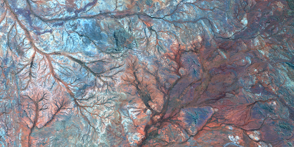
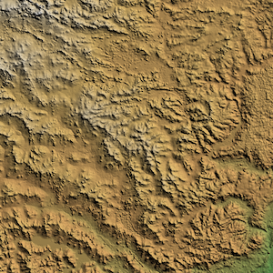
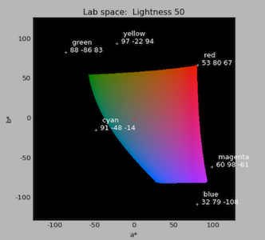
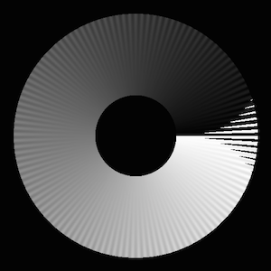

Function Reference
==================

## Index

* [cmap](#cmap) - Library of perceptually uniform colour maps.
* [equalisecolourmap/equalizecolormap](#equalisecolourmapequalizecolormap) - Equalise colour contrast over a colour map.
* [linearrgbmap](#linearrgbmap) - Linear rgb colourmap from black to a specified colour.
* [applycolourmap/applycolormap](#applycolourmapapplycolormap) - Applies colourmap to a single channel image to obtain an RGB result.
* [applycycliccolourmap/applycycliccolormap](#applycycliccolourmapapplycycliccolormap) - Applies a cyclic colour map to an image of angular data.
* [applydivergingcolourmap/applydivergingcolormap](#applydivergingcolourmapapplydivergingcolormap) - Applies a diverging colour map to an image.
* [ternaryimage](#ternaryimage) - Perceptualy uniform ternary image from 3 bands of data.
* [relief](#relief) - Generates a relief shaded image.
* [viewlabspace](#viewlabspace) - Visualisation of Lab colour space.
* [sineramp](#sineramp) - Generates sine on a ramp colour map test image.
* [circlesineramp](#circlesineramp) - Generates a test image for evaluating cyclic colour maps.
* [histtruncate](#histtruncate) - Truncates ends of an image histogram.
* [normalise/normalize](#normalisenormalize) - Normalises image values to 0-1, or to desired mean and variance.
* [srgb2lab](#srgb2lab) - Convert RGB colour map or RGB image to Lab.
* [lab2srgb](#lab2srgb) - Convert Lab colour map or Lab image to RGB.
* [convert](#convert) - Conversions provided by this package.

____

## cmap

Library of perceptually uniform colour maps.

Most of these colour maps have been designed to have constant a
magnitude of lightness gradient.  At fine spatial frequencies
perceptual contrast is dominated by *lightness* difference, chroma and
hue are relatively unimportant.


```
Usage:  1:  map = cmap(I, keyword_params ...)
        2:  (map, name, desc) = cmap(I, keyword_params ..., returnname=true)
        3:  cmap(searchStr)
        4:  cmap()

Arguments for Usage 1 and 2:

            I - A string label indicating the colour map to be generated or a
                string specifying a colour map name or attribute to search
                for.  Type 'cmap()' with no arguments to get a full list of
                possible colour maps and their corresponding labels.

  labels:  "L1" - "L15"  for linear maps
           "D1" - "D12"  for diverging maps
           "C1" - "C9"   for cyclic maps
           "R1" - "R3"   for rainbow maps
           "I1" - "I3"   for isoluminant maps

 Some colour maps have alternate labels for convenience and readability.

   map = cmap("L1")  or map = cmap("grey")  will produce a linear grey map.
   cmap()  lists all colour maps and labels.

 Possible keyword parameter options:

    chromaK::Real - The scaling to apply to the chroma values of the colour map,
                    0 - 1.  The default is 1 giving a fully saturated colour map
                    as designed. However, depending on your application you may
                    want a colour map with reduced chroma/saturation values.
                    You can use values greater than 1 however gamut clipping is
                    likely to occur giving rise to artifacts in the colour map. 
           N::Int - Number of values in the colour map. Defaults to 256.
      shift::Real - Fraction of the colour map length N that the colour map is
                    to be cyclically rotated, may be negative.  (Should only be
                    applied to cyclic colour maps!). Defaults to 0.
    reverse::Bool - If true reverses the colour map. Defaults to false.
diagnostics::Bool - If true displays various diagnostic plots. Note the
                    diagnostic plots will be for the map _before_ any cyclic
                    shifting or reversing is applied. Defaults to false.
 returnname::Bool - If true the function returns a tuple of the colourmap, its 
                    name and its description  (colourmap, name, description)
                    The default value is false, just the colourmap is returned.

Returns:
          map - Array of ColorTypes.RGBA{Float64,1} giving the rgb colour map.

     If returnname=true the function additionally returns 
         name - A string giving a nominal name for the colour map
         desc - A string giving a brief description of the colour map
```

Usage 3 and 4:  cmap(searchStr)

Given the large number of colour maps that this function can create this usage
option provides some help by listing the numbers of all the colour maps with
names containing the string 'str'.  Typically this is used to search for
colour maps having a specified attribute: "linear", "diverging", "rainbow",
"cyclic", or "isoluminant" etc.  If 'searchStr' is omitted all colour maps are
listed.  

```
   cmap()              # lists all colour maps
   cmap("diverging")   # lists all diverging colour maps
```
Note the listing of colour maps can be a bit slow because each colour map has to
be created in order to determine its full name.

**Using the colour maps:**

PyPlot:

```
> using PyPlot
> sr = sineramp();    # Generate the sineramp() colour map test image.
> imshow(sr);         # Display with matplotlib's default 'jet' colour map.
                      # Note the perceptual dead spots in the map.
> imshow(sr, cmap = ColorMap(cmap("L3"))); # Apply the cmap() heat colour map.
```

Winston:

```
> using Winston
> colormap(cmap("R1"));    # Set Winston's colour map to the cmap() rainbow 
                           # colour map first.
> imagesc(sr);             # Then display the image

```

Plots:

```
> using Plots
> y=rand(100); 
> scatter(y, zcolor=y, marker=ColorGradient(cmap("R3")));
```

You can also apply a colour map to a single channel image to create a
conventional RGB image. This is recommended if you are using a
diverging or cyclic colour map because it allows you to ensure data
values are honoured appropriately when you map them to colours.

```
  Apply the L4 heat colour map to the test image
> rgbimg = applycolourmap(sr, cmap("L4")[1]);

  Apply a diverging colour map to the test image using 127 as the
  value that is associated with the centre point of the diverging
  colour map
> rgbimg = applydivergingcolourmap(sr, cmap("D1")[1],127);

  Apply a cyclic colour map to the circlesineramp() test image specifying
  a data cyclelength of 2*pi.
> (cr,) = circlesineramp();   # Generate a cyclic colour map test image.
> rgbimg = applycycliccolourmap(cr, cmap("C1")[1], cyclelength=2*pi);

> ImageView.view(rgbimg)      # Display the image with ImageView
> PyPlot.imshow(rgbimg)       # or with PyPlot
```
*Warning* PyPlot and Tk do not seem to coexist very well (Julia can
crash!).  ImageView and Winston use Tk which means that you may have
to take care which image display functions you choose to use.


**Colour Map naming convention:**

```
                    linear_kryw_5-100_c67_n256
                      /      /    |    \    \
  Colour Map attribute(s)   /     |     \   Number of colour map entries
                           /      |      \
     String indicating nominal    |      Mean chroma of colour map
     hue sequence.                |
                              Range of lightness values
```
In addition, the name of the colour map may have cyclic shift information
appended to it, it may also have a flag indicating it is reversed.

```                                              
              cyclic_wrwbw_90-40_c42_n256_s25_r
                                          /    \
                                         /   Indicates that the map is reversed.
                                        /
                  Percentage of colour map length
                  that the map has been rotated by.
```
* Attributes may be: linear, diverging, cyclic, rainbow, or isoluminant.  A
colour map may have more than one attribute. For example, diverging-linear or
cyclic-isoluminant.

* Lightness values can range from 0 to 100. For linear colour maps the two
lightness values indicate the first and last lightness values in the
map. For diverging colour maps the second value indicates the lightness value
of the centre point of the colour map (unless it is a diverging-linear
colour map). For cyclic and rainbow colour maps the two values indicate the
minimum and maximum lightness values. Isoluminant colour maps have only
one lightness value.

* The string of characters indicating the nominal hue sequence uses the following code

```
      r - red      g - green      b - blue
      c - cyan     m - magenta    y - yellow
      o - orange   v - violet
      k - black    w - white      j - grey
```
('j' rhymes with grey). Thus a 'heat' style colour map would be indicated by
the string 'kryw'. If the colour map is predominantly one colour then the
full name of that colour may be used. Note these codes are mainly used to
indicate the hues of the colour map independent of the lightness/darkness and
saturation of the colours.

* Mean chroma/saturation is an indication of vividness of the colour map. A
value of 0 corresponds to a greyscale. A value of 50 or more will indicate a
vivid colour map.

Adding your own colour maps is straightforward. See comments within
the code for instructions for doing this.

Reference: Peter Kovesi. Good Colour Maps: How to Design Them.
[arXiv:1509.03700 [cs.GR] 2015](https://arxiv.org/abs/1509.03700)

## equalisecolourmap/equalizecolormap

Equalise colour contrast over a colour map.

This function is used by cmap() and you would not normally call this function
directly. However, you may want to try using this function to equalise the
perceptual contrast of colour maps obtained from some other source.

```
Usage: newrgbmap = equalisecolourmap(rgblab, map, formula, W, sigma, diagnostics)
                   equalizecolormap(....

Arguments:     rgblab - String "RGB" or "LAB" indicating the type of data
                        in map.
                  map - A Nx3 RGB or CIELAB colour map
                        or an array of ColorTypes.RGBA{Float64} values
              formula - String "CIE76" or "CIEDE2000"
                    W - A 3-vector of weights to be applied to the
                        lightness, chroma and hue components of the
                        difference equation. It is recommended that you
                        use [1, 0, 0] to only take into account lightness.
                        If desired use  [1, 1, 1] for the full formula.
                        See note below.
                sigma - Optional Gaussian smoothing parameter, see
                        explanation below.
               cyclic - Boolean flag indicating whether the colour map is
                        cyclic. This affects how smoothing is applied at
                        the end points.
          diagnostics - Optional boolean flag indicating whether diagnostic
                        plots should be displayed.  Defaults to false.

Returns:    newrgbmap - RGB colour map adjusted so that the perceptual
                        contrast of colours along the colour map is constant.
                        This is a Nx3 Array of Float64 values.
```
Suggested parameters:

The CIE76 and CIEDE2000 colour difference formulas were developed for
much lower spatial frequencies than we are typically interested in.
Neither is ideal for our application.  The main thing to note is that
at *fine* spatial frequencies perceptual contrast is dominated by
*lightness* difference, chroma and hue are relatively unimportant.

For colour maps with a significant range of lightness use:

```
                       formula = "CIE76" or "CIEDE2000"
                             W = [1, 0, 0]  (Only correct for lightness)
                         sigma = 5 - 7
```
For isoluminant or low lightness gradient colour maps use:  

```
                       formula = "CIE76"
                             W = [1, 1, 1]  (Correct for colour and lightness)
                         sigma = 5 - 7
```
Ideally, for a colour map to be effective the perceptual contrast along the
colour map should be constant.  Many colour maps are very poor in this regard.
Try testing your favourite colour map on the sineramp() test image.  The
perceptual contrast is very much dominated by the contrast in colour lightness
values along the map.  This function attempts to equalise the chosen
perceptual contrast measure along a colour map by stretching and/or
compressing sections of the colour map.

This function's primary use is for the correction of colour maps generated by
cmap() however it can be applied to any colour map.  There are limitations to
what this function can correct.  When applied to some of MATLAB's colour maps
such as 'jet', 'hsv' and 'cool' you get colour discontinuity artifacts because
these colour maps have segments that are nearly constant in lightness.
However, it does a nice job of fixing up MATLAB's 'hot', 'winter', 'spring'
and 'autumn' colour maps.  If you do see colour discontinuities in the
resulting colour map try changing W from [1, 0, 0] to [1, 1, 1], or some
intermediate weighting of [1, 0.5, 0.5], say.

Difference formula: Neither CIE76 or CIEDE2000 difference measures are ideal
for the high spatial frequencies that we are interested in.  Empirically I
find that CIEDE2000 seems to give slightly better results on colour maps where
there is a significant lightness gradient (this applies to most colour maps).
In this case you would be using a weighting vector W = [1, 0, 0].  For
isoluminant, or low lightness gradient colour maps where one is using a
weighting vector W = [1, 1, 1] CIE76 should be used as the CIEDE2000 chroma
correction is inapropriate for the spatial frequencies we are interested in.

Weighting vetor W: The CIEDE2000 colour difference formula incorporates the
scaling parameters kL, kC, kH in the demonimator of the lightness, chroma, and
hue difference components respectively.  The 3 components of W correspond to
the reciprocal of these 3 parameters.  (I do not know why they chose to put
kL, kC, kH in the denominator. If you wanted to ignore, say, the chroma
component you would have to set kC to Inf, rather than setting W[2] to 0 which
seems more sensible to me).  If you are using CIE76 then W[2] amd W[3] are
applied to the differences in a and b.  In this case you should ensure W[2] =
W[3].  In general, for the spatial frequencies of interest to us, lightness
differences are overwhelmingly more important than chroma or hue and W shoud
be set to [1, 0, 0]

Smoothing parameter sigma:
The output colour map will have lightness values of constant slope magnitude.
However, it is possible that the sign of the slope may change, for example at
the mid point of a bilateral colour map.  This slope discontinuity of lightness
can induce a false apparent feature in the colour map.  A smaller effect is
also occurs for slope discontinuities in a and b.  For such colour maps it can
be useful to introduce a small amount of smoothing of the Lab values to soften
the transition of sign in the slope to remove this apparent feature.  However
in doing this one creates a small region of suppressed luminance contrast in
the colour map which induces a 'blind spot' that compromises the visibility of
features should they fall in that data range.  Accordingly the smoothing
should be kept to a minimum.  A value of sigma in the range 5 to 7 in a 256
element colour map seems about right.  As a guideline sigma should not be more
than about 1/25 of the number of entries in the colour map, preferably less.


## linearrgbmap

Linear rgb colourmap from black to a specified colour

```
Usage: cmap = linearrgbmap(C, N)

Arguments:  C - 3-vector specifying RGB colour
            N - Number of colourmap elements, defaults to 256

Returns: cmap - N element ColorTypes.RGBA colourmap ranging from [0 0 0]
                to RGB colour C
```
It is suggested that you pass the resulting colour map to equalisecolourmap()
to obtain a map with uniform steps in perceptual lightness

```
> cmap = equalisecolourmap("rgb", linearrgbmap(C, N))
```


## applycolourmap/applycolormap

Applies colourmap to a single channel image to obtain an RGB result.

```
Usage: rgbimg = applycolourmap(img, cmap, rnge)

Arguments:  img - Single channel image to apply colourmap to.
                  ::AbstractImage{T,2} or ::Array{Float64,2}
           cmap - RGB colourmap as generated by cmap().
                  ::Array{ColorTypes.RGBA{Float64},1}
           rnge - Optional 2-vector specifying the min and max values in
                  the image to be mapped across the colour map.  Values
                  outside this range are mapped to the end points of the
                  colour map.  If rnge is omitted the full range
                  of image values are used.

Returns: rgbimg - RGB image of floating point values in the range 0-1.
                  NaN values in the input image are rendered as black.
                  ::AbstractImage{Float64,3} or ::Array{Float64,3}
```
Why use this function when you can simply set a colour map?

Well, actually you probably want to use the functions
applycycliccolourmap() and applydivergingcolourmap() which make use of
this function.

Many visualisation packages may automatically apply an offset and
perform some scaling of your data to normalise it to a range of, say,
0-255 before applying a colour map and rendering it on your screen.
In many cases this is useful. However, if you are wanting to render
your data with a diverging or cyclic colour map then this behaviour is
definitely not appropriate because these types of colour maps requires
that data values are honoured in some way to make any sense.

By providing a 'range' parameter this function allows you to apply a
colour map in a way that respects your data values.

## applycycliccolourmap/applycycliccolormap

Applies a cyclic colour map to an image of angular data.

For angular data to be rendered correctly it is important that the data values
are respected so that data values are correctly assigned to specific entries
in a cyclic colour map.  The assignment of values to colours also depends on
whether the data is cyclic over pi, or 2*pi.  

In contrast, default display methods typically do not respect data values
directly and can perform inappropriate offsetting and normalisation of the
angular data before display and rendering with a colour map.

The rendering of the angular data with a specified colour map can be modulated
as a function of an associated image amplitude.  This allows the colour map
encoding of the angular information to be modulated to represent the
amplitude/reliability/coherence of the angular data.

```
Usage: rgbimg = applycycliccolourmap(ang, cmap)
       rgbimg = applycycliccolourmap(ang, cmap, keyword args ...)

Arguments:
           ang - Image of angular data to be rendered
                 ::AbstractImage or ::Array{Float64,2}
          cmap - Cyclic colour map to render the angular data with.

Keyword arguments:

           amp - Amplitude image used to modulate the mapped colours of the
                 angular data.  If not supplied no modulation of colours is
                 performed.
                 ::AbstractImage or ::Array{Float64,2}
   modtoblack  - Boolean flag/1 indicating whether the amplitude image is used to
                 modulate the colour mapped image values towards black,
                 or towards white.  The default is true, towards black.
   cyclelength - The cycle length of the angular data.  Use a value of pi
                 if the data represents orientations, or 2*pi if the data
                 represents phase values.  If the input data is in degrees
                 simply set cycle in degrees and the data will be
                 rendered appropriately. Default is 2*pi.

Returns: rgbim - The rendered image.
                 ::AbstractImage{Float64,3} or ::Array{Float64,3}
```

For a list of all cyclic colour maps that can be generated by cmap() use:

```
> cmap("cyclic")  
```

## applydivergingcolourmap/applydivergingcolormap

Applies a diverging colour map to an image.

For data to be displayed correctly with a diverging colour map it is
important that the data values are respected so that the reference value in
the data is correctly associated with the centre entry of a diverging
colour map.

In contrast, default display methods typically do not respect data values
directly and can perform inappropriate offsetting and normalisation of the
data before display and rendering with a colour map.

```
Usage:  rgbim = applydivergingcolourmap(img, map, refval)

Arguments:
           img - Image to be rendered.  ::AbstractImage or ::Array{Float64,2}
           map - Colour map to render the data with.
        refval - Reference value to be associated with centre point of
                 diverging colour map.  Defaults to 0.
Returns:
        rgbimg - The rendered image.
                 ::AbstractImage{Float64,3} or ::Array{Float64,3}
```
For a list of all diverging colour maps that can be generated by cmap()
use:

```
> cmap("div")
```


## ternaryimage


Perceptualy uniform ternary image from 3 bands of data.

This function generates a ternary image using 3 basis colours that are
closely matched in lightness, as are their secondary colours.  The
colours are not as vivid as the RGB primaries but they produce ternary
images with consistent feature salience no matter what permutation of
channel-colour assignement is used.  This is in contrast to ternary
images constructed with the RGB primaries where the channel that
happens to get encoded in green dominates the perceptual result.

Useful for Landsat imagery or radiometric images.

```
Usage: rgbimg = ternaryimage(img, bands, histcut, RGB)

Argument:
            img - Multiband image with at least 3 bands.
                  ::AbstractImage{T,3} or ::Array{T<:Real,3}

Keyword arguments:
          bands - Array of 3 values indicating the bands, to be assigned to
                  the red, green and blue basis colour maps.  If omitted
                  bands defaults to [1, 2, 3].
        histcut - Percentage of image band histograms to clip.  It can be
                  useful to clip 1-2%. If you see lots of white in your
                  ternary image you have clipped too much. Defaults to 0.
            RGB - Boolean flag, if set to true the classical RGB primaries
                  are used to construct the ternary image rather than the
                  lightness matched primaries. Defaults to false.

Returns:  
          rgbimg - RGB ternary image
                  ::AbstractImage{T,3} or ::Array{T<:Real,3}
```
For the derivation of the three primary colours see:
Peter Kovesi. Good Colour Maps: How to Design Them.
[arXiv:1509.03700 [cs.GR] 2015](https://arxiv.org/abs/1509.03700)


## relief


Generates relief shaded image

```
Usage:  shadeimg = relief(img, azimuth, elevation, gradscale, rgbimg)

Arguments: img - Image/heightmap to be relief shaded.
       azimuth - Of light direction in degrees. Zero azimuth points
                 upwards and increases clockwise. Defaults to 45.
     elevation - Of light direction in degrees. Defaults to 45.
     gradscale - Scaling to apply to the surface gradients.  If the shading
                 is excessive decrease the scaling. Try successive doubling
                 or halving to find a good value.
        rgbimg - Optional RGB image to which the shading pattern derived
                 from 'img' is applied.   Alternatively, rgbimg can be a
                 colour map of type ::Array{ColorTypes.RGB{Float64},1}
                 obtained from cmap().  This colour map is applied to the input
                 image/heightmap in order to obtain a RGB image to which
                 the shading pattern is applied.
```
Lambertian shading is used to form the relief image.  This obtained from the
cosine of the angle between the surface normal and light direction.  Note that
shadows are ignored.  Thus a small feature that might otherwise be in the
shadow of a nearby large structure is rendered as if the large feature was not
there.


## viewlabspace


Visualisation of Lab colour space

```
Usage:    viewlabspace(L = 50, figNo = 1)

Arguments:     L - Lightness level in which to display slice of L*a*b* space
           figNo - PyPlot figure to use
```
Function allows interactive viewing of a sequence of images corresponding to
different slices of lightness in L*a*b* space.  Lightness varies from 0 to 100.  Initially a slice at a lightness of 50 is displayed. You can then
repeatedly enter new lightness levels to display, or type 'x' to exit.

To Do:
The CIELAB colour coordinates of the cursor position within the slice images
should be updated continuously.  This is useful for determining suitable control
points for the definition of colourmap paths through CIELAB space in cmap().


## sineramp  


Generates sine on a ramp colour map test image.

The test image consists of a sine wave superimposed on a ramp function The
amplitude of the sine wave is modulated from its full value at the top of the
image to 0 at the bottom.

The image is useful for evaluating the effectiveness of different colour maps.
Ideally the sine wave pattern should be equally discernible over the full
range of the colour map.  In addition, across the bottom of the image, one
should not see any identifiable features as the underlying signal is a smooth
ramp.  In practice many colour maps have uneven perceptual contrast over their
range and often include 'flat spots' of no perceptual contrast that can hide
significant features.

```
Usage: img = sineramp(sze, amp, wavelen, p)
       img = sineramp()

Arguments:     sze - (rows, cols) specifying size of test image.  
                     Defaults to (256 512)  Note the number of columns is
                     nominal and will be ajusted so that there are an
                     integer number of sine wave cycles across the image.
               amp - Amplitude of sine wave. Defaults to 12.5
           wavelen - Wavelength of sine wave in pixels. Defaults to 8.
                 p - Power to which the linear attenuation of amplitude,
                     from top to bottom, is raised.  For no attenuation use
                     p = 0.  For linear attenuation use a value of 1.  For
                     contrast sensitivity experiments use larger values of
                     p.  The default value is 2.
```
The ramp function that the sine wave is superimposed on is adjusted slightly
for each row so that each row of the image spans the full data range of 0 to 255.  Thus using a large sine wave amplitude will result in the ramp at the
top of the test image being reduced relative to the slope of the ramp at
the bottom of the image.

To start with try

```
  > img = sineramp()
```
This is equivalent to

```
  > img = sineramp((256 512), 12.5, 8, 2)
```
View it under 'gray' then try the 'jet', 'hsv', 'hot' etc colour maps.  The
results may cause you some concern!

If you are wishing to evaluate a cyclic colour map, say hsv, it is suggested
that you use the test image generated by circlesineramp().  

The Default Wavelength:
The default wavelength is 8 pixels.  On a computer monitor with a nominal
pixel pitch of 0.25mm this corresponds to a wavelength of 2mm.  With a monitor
viewing distance of 600mm this corresponds to 0.19 degrees of viewing angle or
approximately 5.2 cycles per degree.  This falls within the range of spatial
frequencies (3-7 cycles per degree ) at which most people have maximal
contrast sensitivity to a sine wave grating (this varies with mean luminance).
A wavelength of 8 pixels is also sufficient to provide a reasonable discrete
representation of a sine wave.  The aim is to present a stimulus that is well
matched to the performance of the human visual system so that what we are
primarily evaluating is the colour map's perceptual contrast and not the visual
performance of the viewer.

The Default Amplitude:
This is set at 12.5 so that from peak to trough we have a local feature of
magnitude 25.  This is approximately 10% of the 256 levels in a standard
colour map. It is not uncommon for colour maps to have perceptual flat spots
that can hide features of this magnitude.


## circlesineramp



Generates a test image for evaluating cyclic colour maps.

```
Usage: (img, alpha) = circlesineramp(sze, amp, wavelen, p, hole)
       (img, alpha) = circlesineramp()

Arguments:     sze - Size of test image.  Defaults to 512x512.
               amp - Amplitude of sine wave. Defaults to pi/10
           wavelen - Wavelength of sine wave at half radius of the
                     circular test image. Defaults to 8 pixels.
                 p - Power to which the linear attenuation of amplitude,
                     from outside edge to centre, is raised.  For no
                     attenuation use p = 0.  For linear attenuation use a
                     value of 1.  The default value is 2, quadratic
                     attenuation.
              hole - Boolean flag indicating whether the test image should have
                     a 'hole' in its centre.  The default is true, to have a
                     hole, this removes the distraction of the orientation
                     singularlity at the centre.
Returns:
                im - The test image.
             alpha - Alpha mask matching the regions outside of of the
                     circular test image that are set to NaN.  Used if you
                     want to write an image with these regions transparent.
```
The test image is a circular pattern consistsing of a sine wave superimposed
on a spiral ramp function.  The spiral ramp starts at a value of 0 pointing
right, increasing anti-clockwise to a value of 2*pi as it completes the full
circle. This gives a 2*pi discontinuity on the right side of the image.  The
amplitude of the superimposed sine wave is modulated from its full value at
the outside of the circular pattern to 0 at the centre.  The default sine wave
amplitude of pi/10 means that the overall size of the sine wave from peak to
trough represents 2*(pi/10)/(2*pi) = 10% of the total spiral ramp of 2*pi.  If
you are testing your colour map over a cycle of pi you should use amp = pi/20
to obtain an equivalent ratio of sine wave to circular ramp.

The image is designed for evaluating the effectiveness of cyclic colour maps.
It is the cyclic companion to sineramp().  Ideally the sine wave pattern should
be equally discernible over all angles around the test image.  In practice
many colourmaps have uneven perceptual contrast over their range and often
include 'flat spots' of no perceptual contrast that can hide significant
features.  Try a HSV colour map.

Ideally the test image should be rendered with a cyclic colour map using
showangularim() though, in this case, rendering the image with SHOW or IMAGESC
will also be fine because all image values lie within, and use the full range
of, 0-2*pi.  However, in general, default display methods typically do not
respect data values directly and can perform inappropriate offsetting and
normalisation of the angular data before display and rendering with a colour
map.

For angular data to be rendered correctly it is important that the data values
are respected so that data values are correctly assigned to specific entries
in a cyclic colour map.  The assignment of values to colours also depends on
whether the data is cyclic over pi, or 2*pi.  


## histtruncate

Truncates ends of an image histogram.

Function truncates a specified percentage of the lower and
upper ends of an image histogram.

This operation allows grey levels to be distributed across
the primary part of the histogram.  This solves the problem
when one has, say, a few very bright values in the image which
have the overall effect of darkening the rest of the image after
rescaling.

```
Usage:
1)   newimg = histtruncate(img, lHistCut, uHistCut)
2)   newimg = histtruncate(img, HistCut)

Arguments:
 Usage 1)
   img         -  Image to be processed.
   lHistCut    -  Percentage of the lower end of the histogram
                  to saturate.
   uHistCut    -  Percentage of the upper end of the histogram
                  to saturate.  If omitted or empty defaults to the value
                  for lHistCut.
 Usage 2)
   HistCut     -  Percentage of upper and lower ends of the histogram to cut.

Returns:
   newimg      -  Image with values clipped at the specified histogram
                  fraction values.  If the input image was colour the
                  lightness values are clipped and stretched to the range
                  0-1.  If the input image is greyscale no stretching is
                  applied. You may want to use normalise() to achieve this.
```

## normalise/normalize

Normalises image values to 0-1, or to desired mean and variance.

```
Usage 1:      nimg = normalise(img)

```
Offsets and rescales image so that the minimum value is 0
and the maximum value is 1.  

```
Usage 2:      nimg = normalise(img, reqmean, reqvar)

Arguments:  img     - A grey-level input image.
            reqmean - The required mean value of the image.
            reqvar  - The required variance of the image.
```
Offsets and rescales image so that nimg has mean reqmean and variance
reqvar.  


## srgb2lab

Convenience function for converting an Nx3 array of RGB values in a
colour map to an Nx3 array of CIELAB values.  Function can also be
used to convert a 3 channel RGB image to a 3 channel CIELAB image

Note it appears that the Colors.convert() function uses a default white
point of D65

```
 Usage:  lab = srgb2lab(rgb)

 Argument:    rgb - A N x 3 array of RGB values or a 3 channel RGB image.
 Returns:     lab - A N x 3 array of Lab values of a 3 channel CIELAB image.

```

## lab2srgb

Convenience function for converting an Nx3 array of CIELAB values in a
colour map to an Nx3 array of RGB values.  Function can also be
used to convert a 3 channel CIELAB image to a 3 channel RGB image

Note it appears that the Colors.convert() function uses a default white
point of D65

```
 Usage:  rgb = srgb2lab(lab)

 Argument:   lab - A N x 3 array of CIELAB values of a 3 channel CIELAB image.
 Returns:    rgb - A N x 3 array of RGB values or a 3 channel RGB image.
```

## convert

The following conversions are provided by the package:

* Convert an array of ColorTypes RGBA values to an array of UInt32 values
for use as a colour map in Winston

```
convert(::Type{UInt32}, rgb::Array{ColorTypes.RGBA{Float64},1})
```

* Convert Nx3 Float64 array to  N array of ColorTypes.RGB{Float64}

```
convert(::Type{Array{ColorTypes.RGB{Float64},1}}, cmap::Array{Float64,2})
convert(::Type{Array{ColorTypes.RGBA{Float64},1}}, cmap::Array{Float64,2})
```

* Convert N array of ColorTypes.RGB{Float64} to Nx3 Float64 array

```
convert(::Type{Array{Float64,2}}, rgbmap::Array{ColorTypes.RGB{Float64},1})
convert(::Type{Array{Float64,2}}, rgbmap::Array{ColorTypes.RGBA{Float64},1})
```
